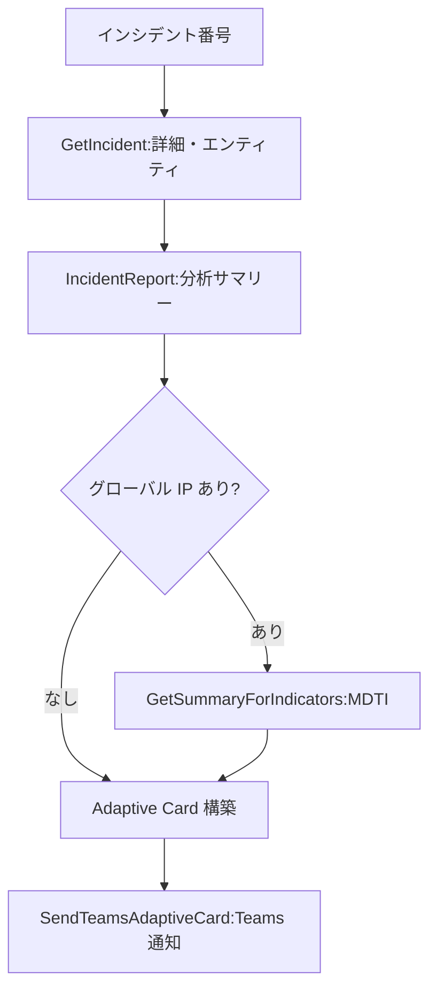

# Defender Incident Teams Notifier (Defender版)

Defender インシデント番号を受け取り、Security Copilot 組み込みの **Defender プラグインスキル** でインシデント詳細・アラート・エンティティを取得し、重要度別カラーコーディングを施した **Adaptive Card** として Microsoft Teams チャンネルに通知する Security Copilot カスタムエージェントです。

エンティティにグローバル IP が含まれる場合は **MDTI (Microsoft Defender Threat Intelligence)** でレピュテーションを確認し、カードに脅威インテリジェンスを付与します。**Sentinel ワークスペース設定が不要**で、Defender ライセンスのみで動作します。

## エージェント概要

| 項目 | 内容 |
|------|------|
| **名前** | Defender Incident Teams Notifier (Defender版) |
| **種別** | Interactive Agent (パラメータ起動 / Logic App 自動起動) |
| **モデル** | gpt-4.1 |
| **入力** | Defender インシデント番号 |
| **出力形式** | Teams Adaptive Card (Logic App 経由) |
| **依存** | Defender ライセンスのみ (Sentinel 不要) |

## Teams 通知例


## 機能

### 1. インシデント詳細の取得
- 組み込み Defender スキル `GetIncident` でタイトル・重要度・ステータス・作成日時・アラート・エンティティ・MITRE ATT&CK・担当者を取得
- `IncidentReport` で分析サマリーを取得
- 英語のタイトル・アラート・サマリーは **日本語に翻訳** (固有名詞・IP・ホスト名は原文維持)

### 2. 作成日時の JST 表示
- `GetIncident` が返す UTC を **9 時間加算して日本標準時 (JST, UTC+9) に変換**
- `YYYY-MM-DD HH:MM:SS (JST)` 形式で表記

### 3. MDTI 脅威インテリジェンス連携
- エンティティから IP を抽出し、プライベート IP 範囲を除外して **グローバル IP のみ**を判定
- IP をクレンジング (空白除去・正規 IPv4/IPv6 のみ・ポート/CIDR/URL/ホスト名/`N/A` を除外・重複排除)
- 有効なグローバル IP が **1 件以上残った場合のみ** `GetSummaryForIndicators` (`ThreatIntelligence.DTI`) を呼び出し、Verdict・悪意度スコア・タグ・要約を取得

### 4. 重要度別カラーコーディング
| 重要度 | コンテナースタイル | 色 | アイコン |
|--------|------------------|-----|---------|
| High | `attention` | 赤 | 🔴 |
| Medium | `warning` | 橙 | 🟠 |
| Low | `good` | 緑 | 🟢 |
| Informational | `accent` | 青 | 🔵 |
| Unknown | `default` | グレー | — |

### 5. Teams Adaptive Card 通知
- ヘッダーに盾の絵文字 🛡️ を配置 (Teams 互換のため version **1.5** 固定)
- FactSet (インシデント ID / 作成日時 / アラート数 / MITRE / 担当者)、インシデントサマリー、主なアラート、関連エンティティ、MDTI 結果セクションを構成
- 「Microsoft Defender で開く」ディープリンク付き

> **Teams 互換性に関する注意**: Microsoft Teams は Adaptive Card **v1.5 まで**しかレンダリングできません。v1.6 のネイティブ `Icon` 要素・SVG 画像・data URI SVG・ダーク背景前提の `Light` 文字色は使用していません。

## スキル構成

| スキル | スキルセット | 用途 |
|--------|-------------|------|
| `GetIncident` | `Fusion` (Defender プラグイン経由) | インシデント詳細・エンティティ取得 |
| `IncidentReport` | `Fusion` (Defender プラグイン経由) | 分析サマリー取得 |
| `GetSummaryForIndicators` | `ThreatIntelligence.DTI` | グローバル IP の MDTI レピュテーション |
| `SendTeamsAdaptiveCard` | LogicApp | Teams へ Adaptive Card 送信 |

### 必要スキルセット (RequiredSkillsets)

- `DefenderIncidentTeamsNotifier` (本プラグイン)
- `Fusion`
- `M365` (Microsoft Defender XDR プラグイン)
- `ThreatIntelligence.DTI`

> **Note**: Defender スキル (`GetIncident` / `IncidentReport`) は Microsoft Defender XDR プラグインに委譲されます。そのためのスキルセット名は `M365` です (`Defender` は KQL ターゲット名であり、スキルセット名としては無効)。

## ワークフロー



## 構成ファイル

| ファイル | 説明 |
|---------|------|
| `DefenderIncidentTeamsNotifier_Defender.yaml` | エージェント本体 (Defender 版マニフェスト) |
| `DefenderIncidentTeamsNotifier_LogicApp_ARM.json` | Teams 通知 Logic App (手動 HTTP トリガー) |
| `DefenderIncidentTeamsNotifier_SentinelPlaybook_ARM.json` | Sentinel Playbook (インシデント Webhook → 「Execute a Security Copilot Agent」でエージェントを起動) |
| `DefenderIncidentTeamsNotifier_card.html` | カードの可視化サンプル |

> **2 つの Logic App の違い**:
> - **`PluginLogicApp_DefenderIncidentTeamsNotifier`** … 手動 HTTP Request トリガー。エージェントの `SendTeamsAdaptiveCard` が呼び出す通知用 Logic App。**エージェント設定の `LogicAppWorkflowName` にはこちらを指定する。**
> - **`Playbook_DefenderIncidentTeamsNotifier`** … Sentinel インシデント Webhook トリガー。エージェント自体を起動する Playbook。

## デプロイ手順

### 1. Teams 通知 Logic App のデプロイ

ARM テンプレート `DefenderIncidentTeamsNotifier_LogicApp_ARM.json` をデプロイします。

```powershell
az deployment group create `
  --resource-group <YOUR-RESOURCE-GROUP> `
  --template-file DefenderIncidentTeamsNotifier_LogicApp_ARM.json `
  --parameters teamsGroupId=<TEAMS-GROUP-ID> teamsChannelId=<TEAMS-CHANNEL-ID>
```

| パラメータ | 説明 | 既定値 |
|-----------|------|--------|
| `logicAppName` | Logic App リソース名 | `PluginLogicApp_DefenderIncidentTeamsNotifier` |
| `teamsGroupId` | 通知先 Teams チームのグループ ID (GUID) | (必須) |
| `teamsChannelId` | 通知先 Teams チャンネル ID | (必須) |
| `location` | デプロイ先リージョン | リソース グループのリージョン |

デプロイ後、Logic App の **Microsoft Teams 接続を承認**してください。

### 2. Security Copilot へのエージェント登録

1. Security Copilot ポータルで **[Settings]** → **[Custom plugins]** → **[Add plugin]**
2. `DefenderIncidentTeamsNotifier_Defender.yaml` をアップロード
3. 設定パラメーターを入力:
   - **LogicAppSubscriptionId**: 通知用 Logic App のサブスクリプション ID
   - **LogicAppResourceGroup**: Logic App のリソース グループ名
   - **LogicAppWorkflowName**: `PluginLogicApp_DefenderIncidentTeamsNotifier`

### 3. (任意) Sentinel Playbook による自動起動

インシデント発生時に自動でエージェントを起動したい場合は、`DefenderIncidentTeamsNotifier_SentinelPlaybook_ARM.json` をデプロイし、Sentinel の自動化ルールから呼び出します。Playbook は Security Copilot コネクタの **「Execute a Security Copilot Agent」** アクションでエージェントを起動し、Defender インシデントの `providerIncidentId` を `DefenderIncidentNumber` 入力としてエージェントに渡します。

```powershell
az deployment group create `
  --resource-group <YOUR-RESOURCE-GROUP> `
  --template-file DefenderIncidentTeamsNotifier_SentinelPlaybook_ARM.json `
  --parameters agentId=<SECURITY-COPILOT-AGENT-ID>
```

| パラメータ | 説明 | 既定値 |
|-----------|------|--------|
| `playbookName` | Playbook (Logic App) リソース名 | `Playbook_DefenderIncidentTeamsNotifier` |
| `agentId` | Security Copilot にデプロイ済みのエージェント ID (GUID)。Security Copilot ポータルのエージェント詳細から取得 | (必須) |
| `securityCopilotConnectionName` | Security Copilot API 接続名 | `securitycopilot` |
| `azureSentinelConnectionName` | Microsoft Sentinel API 接続名 | `azuresentinel` |
| `location` | デプロイ先リージョン | リソース グループのリージョン |

デプロイ後、Playbook の **Security Copilot 接続と Microsoft Sentinel 接続を承認**し、Sentinel の自動化ルールでこの Playbook を割り当ててください。エージェントの実行結果は対象インシデントへのコメントとして記録されます。

## 使い方

### 手動実行
1. エージェントを開き、**DefenderIncidentNumber** にインシデント番号 (例: `12345`) を入力
2. `実行` をトリガーするとインシデントが分析され、Teams チャンネルへ通知されます

### 自動実行
Sentinel Playbook を経由し、インシデント発生時に自動で通知が送信されます。

## 前提条件

- Microsoft Defender XDR ライセンス (Microsoft Defender XDR プラグインが有効化されていること)
- Microsoft Defender Threat Intelligence (MDTI) へのアクセス (グローバル IP 分析を利用する場合)
- 通知先 Teams チームへの投稿権限を持つアカウント (Logic App の Teams 接続)
- Logic App をデプロイする Azure サブスクリプションとリソース グループ
